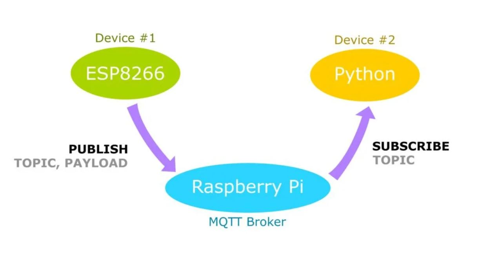
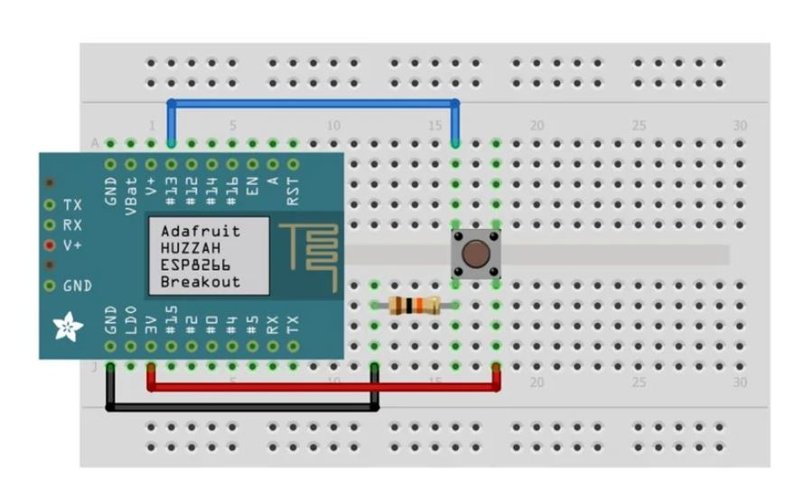

# MQTT-With-the-Raspberry-Pi-and-ESP8266
# ESP8266 publishes and python subscribes.

### Encouraged by  <a href="https://appiko.org/">Appiko</a>

### Introduction
MQTT, or MQ Telemetry Transport, is a messaging protocol which allows multiple devices to talk to each other. MQTT is based around the idea that devices can publish or subscribe to topics.
 
  

### Objective

Publishing to a topic using an ESP8266, and creating a Python script that will subscribe to this same topic, via a Raspberry Pi which will act as the MQTT Broker.

### METHODOLOGY
<ul>
<li>Basic Raspberry Pi Setup
<li>Run and install Mosquitto broker
<li> Installing Python Paho-MQTT
<li> Creating the Python Script
<li> Programming the ESP8266 using arduino
 </ul>
 
 ##### Working schematic
  
